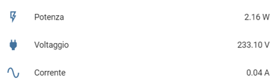

# hassio_meross_sensor_switch
- A Home Assistant custom-component for Meross devices, based 
on the work done by [Alberto Geniola](https://github.com/albertogeniola/MerossIot) and [Chris Hurst](https://github.com/hurstc/hassio-meross)
- This custom-component adds the switch and sensor capabilities of your Meross device in Home Assistant

Devices
============

The custom-component is intended to manage the [Meross smart outlets](https://www.meross.com/product?category_id=4). 
Other types of devices (e.g. 
[bulbs](https://www.meross.com/product?category_id=5), 
[garage door opener](https://www.meross.com/product?category_id=8), etc.) 
**are not currently supported**. 

The custom-component has been tested with [mss310](https://www.meross.com/product/6/article/) and 
[mss210](https://www.meross.com/product/3/article/) version 2.0.0 smart outlets.
However, refer to [Alberto Geniola](https://github.com/albertogeniola/MerossIot) for the full compatibility list.

The custom-component will discover the Meross devices associated to your Meross account and will add switches and 
sensors (measuring the electricity: power, voltage and current) in Home Assistant as shown below:

- Example of switches (labels are in Italian):<br/>


- Example of electricity sesnors (labels are in Italian):<br/>

  

Install
============

1. Copy all the ".py" and "manifest.json" files into your "/config/custom_components/meross" folder.
- Your configuration should look like:
```
config
  custom_components
    meross
      __init__.py
      manifest.json
      sensor.py
      switch.py
```

2. **Remember to reboot Hassio (or Home Assistant)**

Dependencies
============
**This custom-component relies on the python meross_iot library developed by [Alberto Geniola](https://github.com/albertogeniola/MerossIot).**
- On [Hassio](https://www.home-assistant.io/hassio/) (i.e., Home Assistant for Raspberry pi) the 
[meross_iot](https://github.com/albertogeniola/MerossIot) framework will be downloaded automatically;
- Note that if you forgot to copy the manifest.json, Hassio will not be able to download automatically its dependencies
- On other [Home Assistant](https://www.home-assistant.io/getting-started/) installations, if the dependencies fails to 
be loaded, install it [manually](https://github.com/albertogeniola/MerossIot#installation). 


Configuration
============

**Add your credentials to configuration.yaml**
- **username** and **password** are **mandatory**
- **scan_interval** is **optional**. It must be a positive integer number. It represents the seconds between two consecutive scans to gather new values of Meross devices' sensors and switches. 
- **meross_devices_scan_interval** is **optional**. It must be a positive integer number. It represents the seconds between two consecutive scans to update the list of available Meross devices. 
```
meross:
  username: !secret meross_userame
  password: !secret meross_password
  scan_interval: 10
  meross_devices_scan_interval: 300
```

Debug
============

- To enable debug diagnostics, add this to your configuration.yaml:
```
logger:
  default: WARNING
  logs:
    meross_sensor: DEBUG
    meross_switch: DEBUG
    meross_init: DEBUG
```

